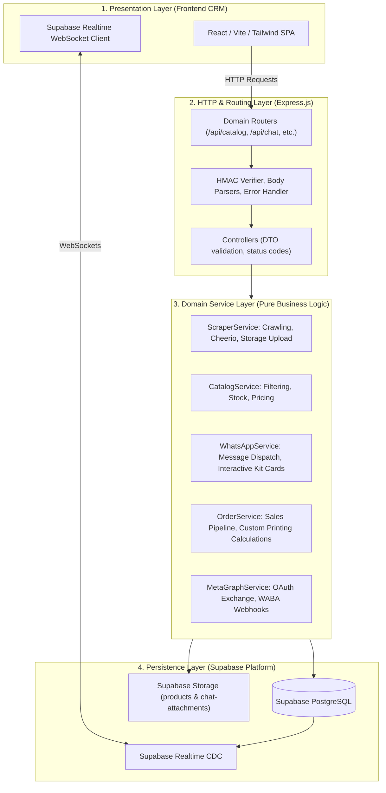
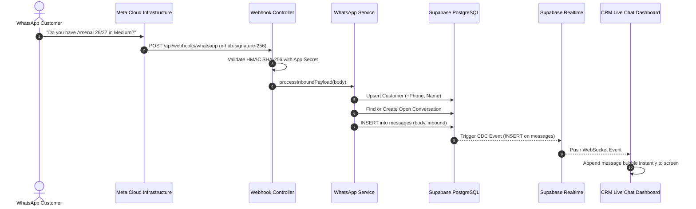
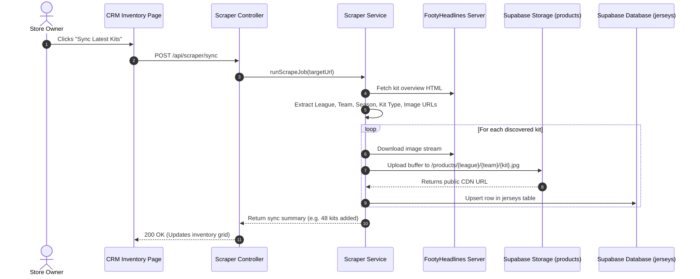

# System Architecture: Jersey Automate Engine

This document defines the architectural principles, structural layers, data flow, and security mechanisms of the **Jersey Automate** platform.

---

## 🏛️ Architectural Principles (Eliminating Spaghetti Code)

To prevent the common pitfalls of monolithic, tangled code ("spaghetti code"), this project enforces four design rules:

1. **Separation of Concerns**: Controllers only handle HTTP translation; Services only execute business logic; Repositories/Database clients only execute queries.
2. **Single Direction Dependency Flow**:
   `Routes` ➔ `Controllers` ➔ `Domain Services` ➔ `Supabase Client / Database`. Services never touch Express `req` or `res` objects.
3. **Stateless Backend**: The Node.js application maintains no local memory state. All state is persisted in Supabase (PostgreSQL), allowing seamless redeployments.
4. **Resilient Third-Party Integration**: Meta Graph API failures, rate limits, and network timeouts are trapped in isolated service methods with fallback strategies.

---

## 📐 Layered Architecture

---

## 🔄 Core Execution Flows

### 1. Inbound WhatsApp Message Flow

### 2. Kit Scrape & Ingestion Flow

---

## 🔒 Security Architecture

1. **Meta Webhook Signature Verification**:
   - Meta signs every webhook payload using HMAC-SHA256 with your `META_APP_SECRET`.
   - The server captures the raw binary buffer in Express (`req.rawBody`).
   - The signature middleware recomputes the HMAC digest and uses `crypto.timingSafeEqual()` to prevent timing attacks.

2. **Access Token Encryption**:
   - Meta long-lived system user tokens are never stored in plain text.
   - Encrypted at rest using **AES-256-GCM** with an initialization vector (IV) and authentication tag.

3. **Input Sanitization**:
   - Webhook inputs and customer message strings are sanitized before database insertion to prevent injection vulnerabilities.
